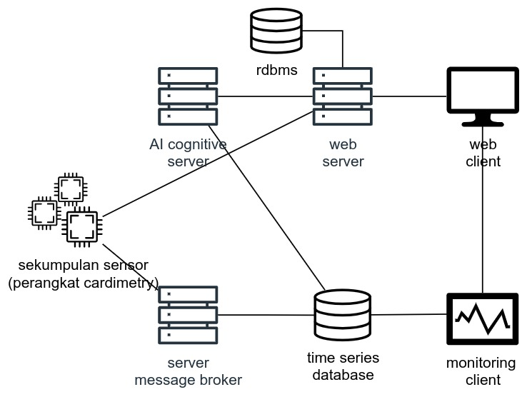

# Diagram Infrastruktur Software


# Konfigurasi Infrastruktur Software
Kode konfigurasi infratruktur: [docker-compose.yml](./docker/docker-compose.yml)

# Requirement
- [Docker Container](https://docs.docker.com/engine/install/) : seluruh infrastruktur (kecuali web server, AI server, dan web client) dijalankan didalam docker container
- PHP versi 8.1^ : untuk menjalankan [web server](https://github.com/Capstone-A14/cardimetry-service)
- Python : untuk menjalankan [AI server](https://github.com/Capstone-A14/ai-service) dan [dummy-client](https://github.com/Capstone-A14/cardimetry-dummy-client)

# Cara Menjalankan Keseluruhan Software
## 1. Jalankan Repo Ini (Infrastruktur)

- Clone repository ini 
- Download folder docker data dari link [ini](https://ugm365-my.sharepoint.com/:u:/g/personal/nismara_chandra_365_ugm_ac_id/EXlSV8VeRT1Bssnbhfj65hwBsIrh7Y4dYI1en0tCIz0Z5Q?e=UCoae0)
- Extract zip yang telah diunduh
- Pindahkan seluruh isi di dalamnya ke directory ``` ./docker/.data ``` di dalam directory [./docker](./docker)
- Masuk ke directory ``` /docker ```
- Jalankan seluruh container dengan command ``` docker compose up ``` atau ``` docker compose up -d ``` untuk menjalankan di belakang layar. Perhatikan log yang berjalan dengan command ``` docker container logs --follow ``` untuk mendeteksi bila terjadi error 
- Buka terminal baru, cek bahwa seluruh container telah berhasil berjalan dengan command ``` docker container list --all ```

## 2. Jalankan Web Server

- Clone repository [ini](https://github.com/Capstone-A14/cardimetry-service)
- Jalankan containter rdbms dengan command ``` docker compose up -d```
- Jalankan command ``` php artisan migrate:fresh ``` untuk memigrasi database dan mengisi dengan data dummy
- Jalankan server dengan command ``` php artisan serve ```

## 3. Publish Data Pasien
Dapat dilakukan dengan menggunakan hardware cardimetry atau cardimetry dummy client yang terdapat pada repository [ini](https://github.com/Capstone-A14/cardimetry-dummy-client)
### 3.1 Menggunakan Cardimetry Dummy Client

- Clone repository [ini](https://github.com/Capstone-A14/cardimetry-dummy-client)
- Install library python yang dibutuhkan
- Jalankan command ``` python cdc_main.py cm99 99  ``` untuk memulai client
- cm99 dan 99 merupakan id alat dan id pasien default

### 3.2 Menggunakan Cardimetry Hardware

- Nyalakan hardawre cardimetry
- Pastikan hardware tersambung dalam satu jaringan dengan komputer server
- Cek ip alamat komputer server yang menjalankan docker container
- Untuk saat ini alamat server masih di hardcode sehingga alamat harus dimodifikasi secara hardcode lalu code dicompile ulang ke hardware cardimetry-nya
- Code cardimetry terdapat di repository [ini](https://github.com/Capstone-A14/cardimetry-mcu)
- Pastikan hardware telah berjalan dengan baik
- Pilih wifi -> masukkan nama alat -> pilih nama pasien -> start publish

Setelah berhasil melakukan publish data, coba akses dan amati tiap-tiap docker container untuk mengecek apakah data telah berhasil dikirim.
Alamat masing-masing container tertera dalam file [docker-compose.yml](./docker/docker-compose.yml)

## 4. Menjalankan AI Service

- Clone repository [ini](https://github.com/Capstone-A14/ai-service)
- Install library python yang dibutuhkan
- Jalankan server dengan command ``` python app.py ```
- Kembalilah ke kode PHP (web server) dan buka terminal baru
- Jalankan perintah ``` php artisan schedule:work ``` untuk menjalankan cronjob yang secara periodis akan meng-invoke server AI
- Amati data yang terekam dalam dashboard grafana. (alamat tertera dalam file docker-compose.yml)


